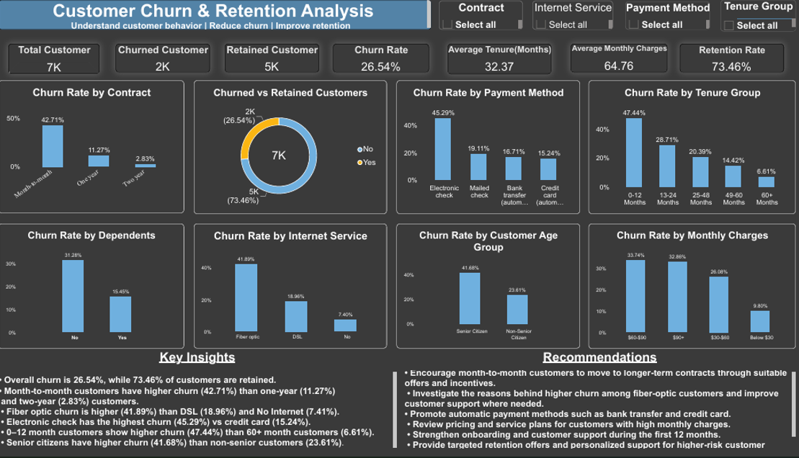

# Customer Churn & Retention Analysis

## Project Overview

This project analyzes customer churn and retention patterns using the Telco Customer Churn dataset. The analysis focuses on identifying high-risk customer segments, churn drivers, customer tenure patterns, payment behavior, internet service usage, and monthly charge patterns.

The dashboard was developed using Excel for data cleaning and Power BI for analysis and visualization.

## Objective

The objective of this project is to:

* Analyze overall customer churn and retention.
* Identify customer segments with higher churn rates.
* Understand the relationship between contract type, tenure, payment method, internet service, and churn.
* Analyze monthly charge patterns and customer lifetime behavior.
* Provide data-driven insights and actionable recommendations.

## Tools Used

* **Excel** – Data cleaning and preparation
* **Power BI** – Data analysis, visualization, and dashboard development
* **DAX** – KPI measures and churn-rate calculations

## Data Cleaning

The dataset was cleaned and prepared before importing it into Power BI.

The main data preparation steps included:

* Checking missing values
* Checking duplicate records
* Standardizing data formats
* Verifying numerical columns
* Ensuring consistent categorical values
* Preparing the cleaned dataset for Power BI analysis

## Key KPIs

| KPI                     |        Value |
| ----------------------- | -----------: |
| Total Customers         |        7,043 |
| Churned Customers       |        1,869 |
| Retained Customers      |        5,174 |
| Churn Rate              |       26.54% |
| Retention Rate          |       73.46% |
| Average Tenure          | 32.37 Months |
| Average Monthly Charges |        64.76 |

## Dashboard Analysis

The Power BI dashboard analyzes:

* Churn Rate by Contract
* Churn Rate by Internet Service
* Churn Rate by Payment Method
* Churn Rate by Tenure Group
* Churn Rate by Dependents
* Churn Rate by Customer Age Group
* Churn Rate by Monthly Charges
* Churned vs Retained Customers

## Key Insights

* Overall churn is **26.54%**, while **73.46%** of customers are retained.
* **Month-to-month** customers have higher churn (**42.71%**) than one-year (**11.27%**) and two-year (**2.83%**) customers.
* **Fiber optic** churn is higher (**41.89%**) than DSL (**18.96%**) and No Internet (**7.41%**).
* **Electronic check** has the highest churn (**45.29%**) among payment methods.
* **0–12 month** customers have higher churn (**47.44%**) than 60+ month customers (**6.61%**).
* **Senior citizens** have higher churn (**41.68%**) than non-senior customers (**23.61%**).

## Recommendations

* Promote longer-term contracts with suitable offers and incentives.
* Investigate higher churn among fiber-optic customers and strengthen customer support.
* Encourage automatic payment methods to improve retention.
* Strengthen onboarding and support during the first 12 months.
* Provide targeted retention offers for high-risk customer segments.

## Project Outcome

The dashboard provides an interactive view of customer churn and retention patterns and helps identify customer groups that may require targeted retention strategies.

## Dashboard Preview

The final Power BI dashboard provides an interactive analysis of customer churn, retention, tenure, payment methods, internet services, customer segments, and monthly charges.

